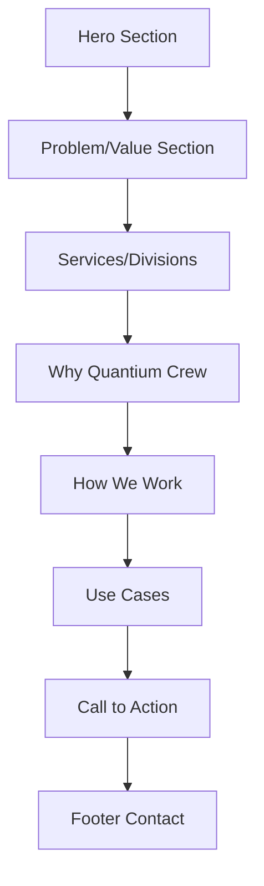

## 1. Product Overview
Quantium Crew is a technology startup website that showcases the company's comprehensive technology ecosystem services. The website serves as the primary digital presence for a modern tech company that designs, builds, and manages digital and physical tech ecosystems for businesses.

The website targets modern businesses seeking proactive technology partnerships rather than reactive IT support, positioning Quantium Crew as a strategic technology partner that engineers scalable solutions.

## 2. Core Features

### 2.1 User Roles
No user registration or authentication required for this marketing website. All content is publicly accessible.

### 2.2 Feature Module
The Quantium Crew website consists of the following main pages:
1. **Home page**: Hero section, problem/value proposition, services divisions, why choose us, how we work, use cases, call to action, footer

### 2.3 Page Details
| Page Name | Module Name | Feature description |
|-----------|-------------|---------------------|
| Home page | Hero section | Display headline "We don't fix technology. We engineer it.", subheadline about ecosystem design, primary CTA "Schedule a free tech assessment", secondary CTA "Explore our solutions" |
| Home page | Problem/Value section | Explain business technology challenges with fragmented systems, position as proactive strategic partner |
| Home page | Services/Divisions | Present 4 divisions: Quantium Dev (development/automation), Quantium Systems (hardware/infrastructure), Quantium Support+ (IT support), Quantium Install (professional installations) |
| Home page | Why Quantium Crew | Highlight startup mindset, fast execution, scalable solutions, one-stop tech partner, growth-focused design |
| Home page | How We Work | 5-step process: Analyze, Design, Build, Optimize, Support |
| Home page | Use Cases | Show scenarios: startup scaling, business automation, IT modernization |
| Home page | Call to Action | Final CTA with headline "Build your technology the right way" and button "Start with Quantium Crew" |
| Home page | Footer | Company name, description, services list, contact form, social media links |

## 3. Core Process
**Visitor Flow:**
1. User lands on homepage and sees hero section with powerful headline
2. Scrolls to understand the problem Quantium Crew solves
3. Explores the 4 service divisions to understand capabilities
4. Reviews why to choose Quantium Crew over competitors
5. Understands the 5-step working process
6. Views real-world use cases and scenarios
7. Reaches final call-to-action to start engagement
8. Can contact via footer form or explore social links

## 4. User Interface Design

### 4.1 Design Style
- **Primary colors**: Black/dark gray background
- **Accent colors**: Electric blue (#00D4FF) or violet (#8B5CF6)
- **Typography**: Modern sans-serif (Inter, Poppins, Space Grotesk style)
- **Button style**: Rounded corners with hover effects
- **Layout**: Clean card-based sections with generous spacing
- **Icons**: Minimalist line icons, no generic stock tech imagery
- **Animations**: Subtle scroll-triggered animations and hover effects

### 4.2 Page Design Overview
| Page Name | Module Name | UI Elements |
|-----------|-------------|-------------|
| Home page | Hero section | Full-width dark background, large typography (48-64px headline), centered layout, prominent CTA buttons with electric blue accent |
| Home page | Problem/Value | Split layout with text content and supporting visual, clean white/gray text on dark background |
| Home page | Services | 4-column grid on desktop, 2-column on tablet, single column on mobile, each division as card with icon and description |
| Home page | Why Choose Us | Numbered or icon-based feature list with generous white space, alternating background subtlety |
| Home page | How We Work | Horizontal process flow diagram or numbered steps with connecting lines, responsive layout |
| Home page | Use Cases | Case study cards with brief descriptions, hover effects for interaction |
| Home page | Final CTA | Full-width section with centered content, contrasting button color |
| Home page | Footer | Multi-column layout with company info, services, contact form, social icons |

### 4.3 Responsiveness
- **Desktop-first approach**: Optimized for 1920px and 1440px widths
- **Mobile adaptive**: Responsive breakpoints at 768px and 480px
- **Touch optimization**: Larger tap targets on mobile, swipe-friendly carousels if needed
- **Typography scaling**: Font sizes adjust appropriately for screen size

### 4.4 3D Scene Guidance
Not applicable - this is a 2D marketing website with modern flat design approach.