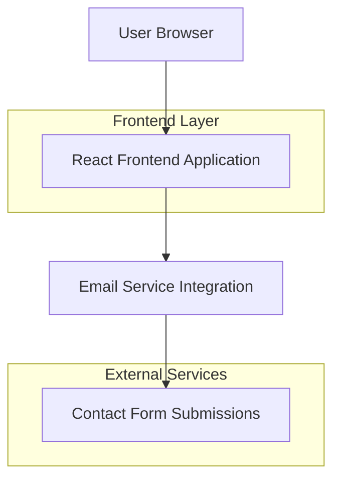

## 1. Architecture design

## 2. Technology Description
- Frontend: React@18 + tailwindcss@3 + vite
- Initialization Tool: vite-init
- Backend: None (static marketing site)
- Contact Form: Email service integration (EmailJS or similar)

## 3. Route definitions
| Route | Purpose |
|-------|---------|
| / | Homepage with all sections (single-page application) |

## 4. API definitions
Not applicable - this is a static marketing website with no backend API requirements.

## 5. Server architecture diagram
Not applicable - static site deployment with no server-side processing required.

## 6. Data model
Not applicable - no database required for this marketing website.